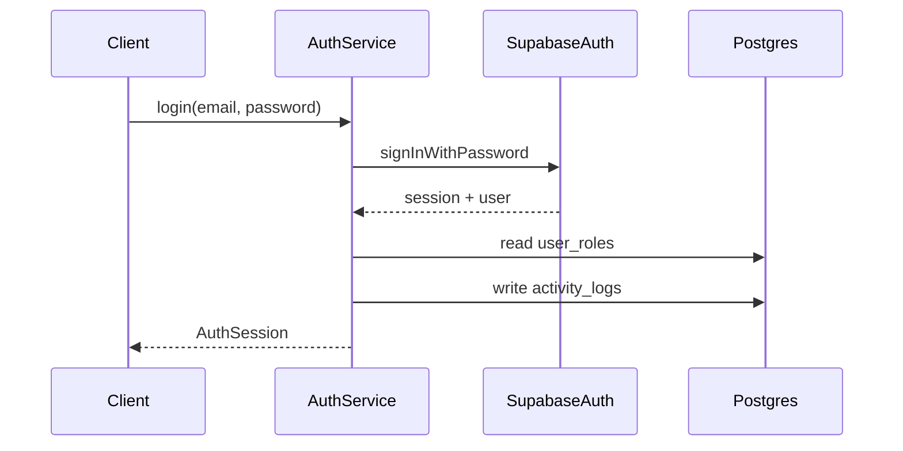

# Session Flow

Access tokens are short lived and refreshed through Supabase Auth refresh rotation. Logout calls Supabase `signOut` with `local`, `global`, or `others` scope depending on whether the user wants to end the current session or all sessions.
