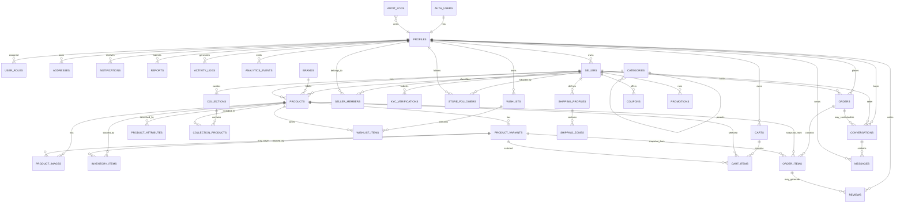

# ER Diagram

This conceptual ER diagram groups the primary database entities and ownership paths.

## Notes

- `AUTH_USERS` represents Supabase-managed `auth.users`; it is not owned by application migrations.
- Order items preserve product snapshots so historical orders survive product edits.
- Reviews attach to products, sellers, buyers, and optionally order items.
- Conversations are between one buyer and one seller, optionally associated with an order.
