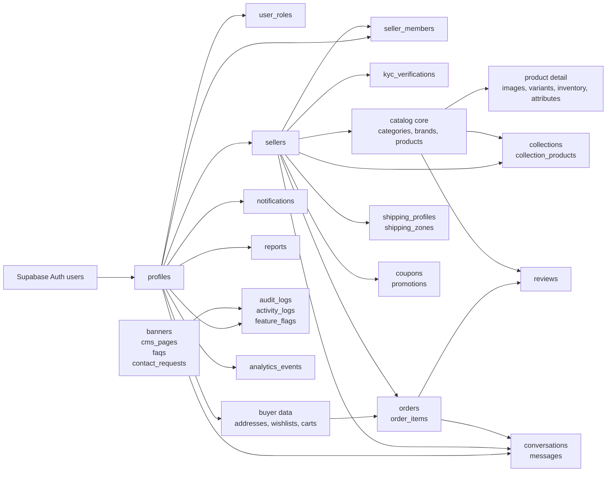

# Relationship Diagram

This diagram emphasizes access paths and module boundaries rather than every column.

## Access Pattern Summary

| Access Pattern | Relationship Path |
|---|---|
| Buyer reads own orders | `profiles.id -> orders.buyer_id` |
| Seller manages products | `profiles.id -> seller_members.user_id -> products.seller_id` or `profiles.id -> sellers.owner_id` |
| Buyer messages seller | `profiles.id -> conversations.buyer_id -> messages.conversation_id` |
| Seller reads conversation | `seller_members.seller_id -> conversations.seller_id` |
| Public product browsing | `product_catalog` view over active `products` and active `sellers` |
| Staff moderation | `user_roles.role in ('admin', 'moderator')` |
